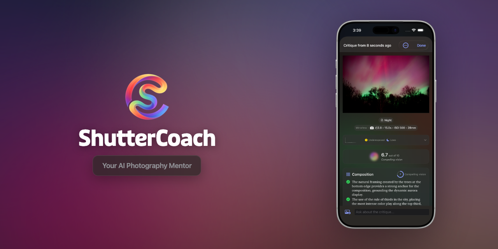
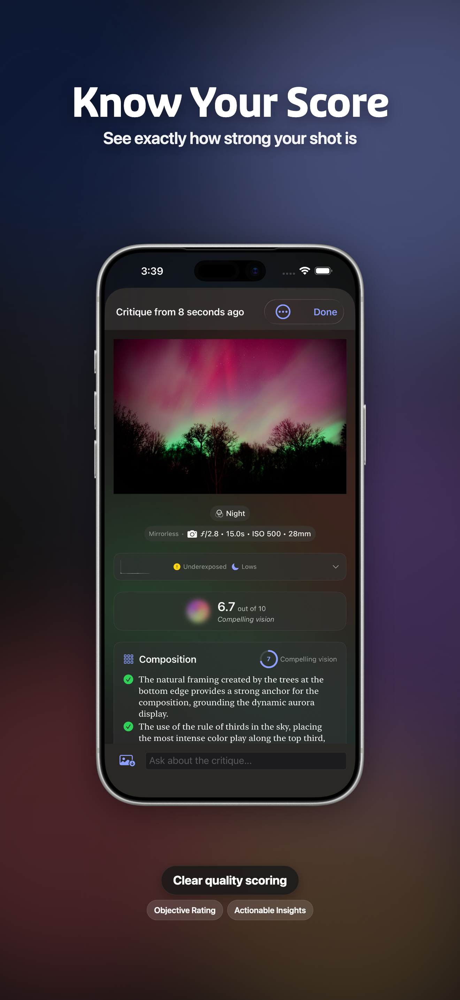
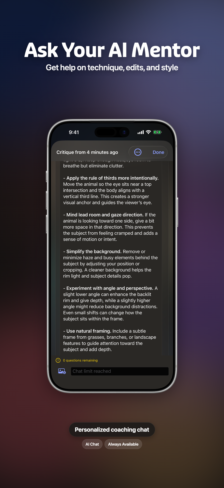

<!-- 1. Hero Banner (centered) -->

  

<!-- 2. App Icon + Title + Tagline -->

  

<h1 align="center">ShutterCoach</h1>

<strong>Your AI Photography Mentor</strong>

<!-- 3. Badges Row -->

  
  
  
  
  

---

<!-- 4. Features -->
## Features

ShutterCoach gives you honest, encouraging feedback on your photos — like having a photography mentor in your pocket.

- **AI-Powered Critique** — Detailed analysis across 6 skills: composition, lighting, exposure, focus, color, and storytelling
- **Photo DNA** — A personalized photography profile that evolves as your skills grow
- **Daily Challenges** — Fresh prompts every day with streak tracking to build better habits
- **Chat with Luna** — Ask follow-up questions and get deeper guidance from your AI mentor
- **Critique Revision Engine** — Compare before/after shots to see how you've improved
- **Achievements & Milestones** — Celebrate your progress with skill-based accomplishments
- **Streaming Feedback** — Watch your critique come to life in real-time with Aurora animations
- **Offline History** — Access your last 500 critiques without internet
- **Privacy-First** — Your photos are never stored on our servers

<!-- 5. How it Works (3-step) -->
## How It Works

| Step | | |
| :--: | :-- | :-- |
| **1** | **Share Your Shot** | Pick any photo from your library |
| **2** | **Get Honest Feedback** | AI analyzes composition, lighting, exposure, focus, color, and storytelling |
| **3** | **Level Up** | Track your Photo DNA as your skills grow |

<!-- 6. Pricing Table -->
## Pricing

| | Free | Plus | Pro |
| :-- | :--: | :--: | :--: |
| **Monthly** | $0 | $5.99 | $14.99 |
| **Annual** | — | $49.99 | $149.99 |
| **Feedback** | 3 shots/day to start, 1/day after your first week | Unlimited feedback on every shot | Unlimited feedback on every shot |
| **Chat** | 1 message per critique | 5 messages per critique | Unlimited |
| **AI Quality** | Standard AI | Enhanced AI | Premium AI |

<!-- 7. Screenshots -->
## Screenshots

  
  &nbsp;&nbsp;
  
  &nbsp;&nbsp;
  

<!-- 8. Built With -->
## Built With

Built with Swift 6, SwiftUI, and multi-model AI.

<!-- 9. Community -->
## Community

We'd love to hear from you! ShutterCoach is closed-source, but your feedback shapes every update.

- **[Discussions](https://github.com/justinthevoid/ShutterCoach/discussions)** — Ask questions, share ideas, or just say hi
- **[Report a Bug](https://github.com/justinthevoid/ShutterCoach/issues/new?template=bug-report.yml)** — Help us squash issues
- **[Request a Feature](https://github.com/justinthevoid/ShutterCoach/issues/new?template=feature-request.yml)** — Tell us what you want next
- **[Contributing Guidelines](CONTRIBUTING.md)** — How to participate

<!-- 10. Support -->
## Support

- **Website:** [shuttercoach.app](https://shuttercoach.app)
- **App Store:** [Download ShutterCoach](https://apps.apple.com/app/id6757127685)
- **Email:** support@shuttercoach.app
- **Twitter/X:** [@ShutterCoach](https://twitter.com/ShutterCoach)
- **Instagram:** [@ShutterCoach](https://instagram.com/ShutterCoach)

Launched January 2026.

### Support Development

If ShutterCoach helps your photography, consider supporting its development:

- [Buy Me a Coffee](https://buymeacoffee.com/justinthevoid)
- [Ko-fi](https://ko-fi.com/joltik)
- [GitHub Sponsors](https://github.com/sponsors/justinthevoid)

<!-- 11. License -->
## License

All Rights Reserved. See [LICENSE](LICENSE).
